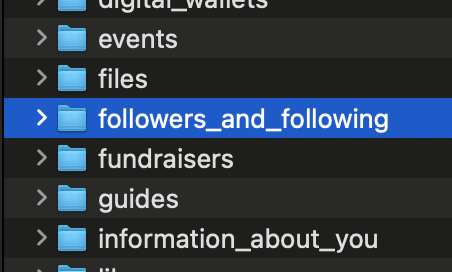
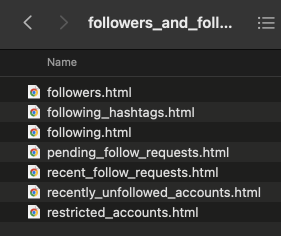
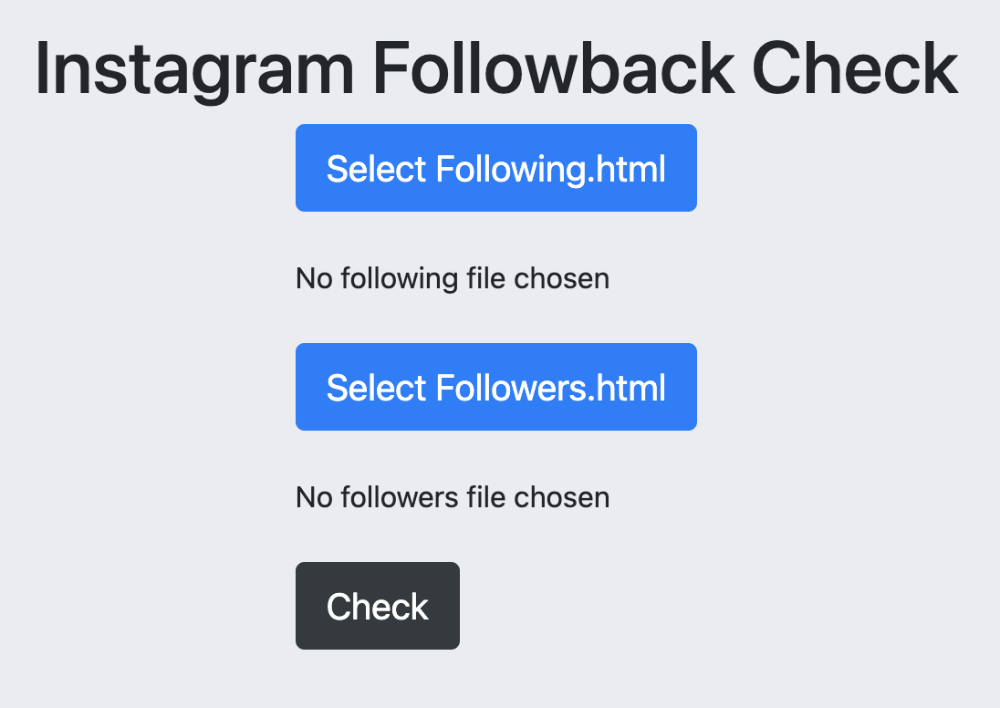

# InstaFollowingBack-Web
<h2>This is the tutorial of the web interface.</h2>

Checking Accounts that are not following back on Instagram with account dumped file HTML

It use local HTML file dumped from Instagram "Request Download" instead of direct loggin the account to avoid getting banned.

<h2>To use this script a local copy of Instagram account data is required.</h2>


# How to dump Instagram archive

On Mobile Devices: Your activity - Download your information - Request Download

On Computers: More - Settings - Privacy and security - Data download - Request download - <b>Select HTML</b>


# How to use the web interface

Unzip the dumped File and navigate to followers_and_following and select
```
followers.html
following.html
```
on the web interface accordingly





Then click "Check".
